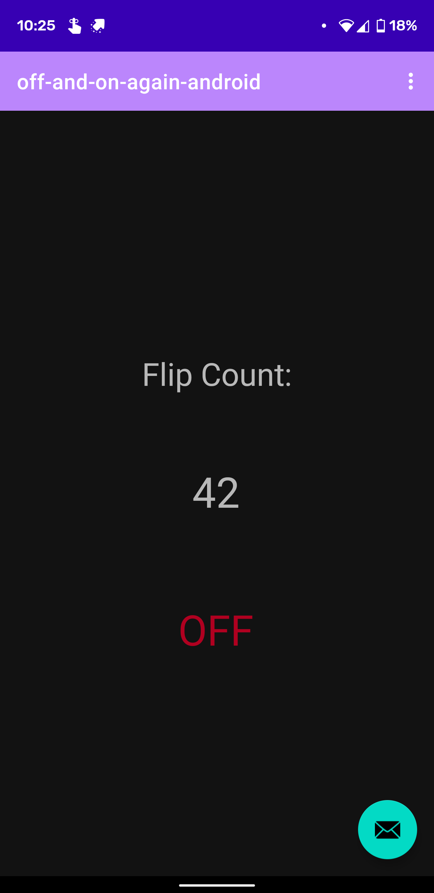

# off-and-on-again

Hey there, thanks for checking out my little project. For context, this is my first
foray into Raspberry Pi tinkering, my second or third Android app, and my second or
third Node.js server. I also spun this all up in roughly a day.

Given those constraints, things are a bit of a mess. I plan to use this code
as a template for larger Pi projects, so I want to clean up the code as I add to it
and learn more about proper architecture.

This README is mostly for my own learning, its probably missing important information
for actually implementing this yourself. Please contact me if you've got any questions!

## What it Does

Flip a physical switch and see a number increment on your smartphone!

(disregard the non-fucntioning FAB that I forgot to remove)  
 

## How it Works

A Python script on the Pi monitors the switch state and sends a signal to update
(via HTTP) to the Node.js server, running on the same Pi. The Node.js server stores
updates a Switch document in MongoDB and sends a JSON object via Socket.io to any
Android clients that are listening on the socket. The Android client then updates
its LiveData and populates its fragment with the new data.

This codebase contains everything to make this work, other than wiring the switch and
configuring the script.  
**Important note: I haven't actually used this with a physical switch yet, as we're waiting
on parts. There's a test script (Flipper.py) in switch-client that I've used to test the 
system. You'll need to fiddle with my script implementation till it works for you. Shouldn't 
be too tough.**

## Understanding the Directory
**switch-client:** Python script/client to monitor sensor/hardware (just a switch rn) running on a Raspberry Pi

**server:** RESTful API on a Node.js server, data hosted via MongoDB

**android-client:** Android client to display sensor (switch) data.

## How to Use

Hit me up and I'll walk you through it. If you've got a wireless Raspberry Pi with a button
or switch wired to it and an Android phone, you should have everything you need.

Basic steps:
1. Clone project onto your Pi
2. Configure switch-client to talk to your button/switch
3. Configure switch-client, server and android-client to use **your** local IP addresses
4. Spin up a MongoDB custer
5. Configure server to speak with your MongoDB cluser.
6. Build the app from Android Studio onto your phone
7. Spin up the server and clients on the Pi
8. Start the app

